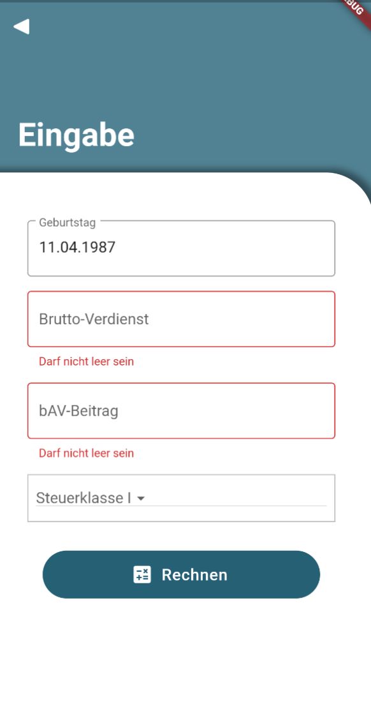
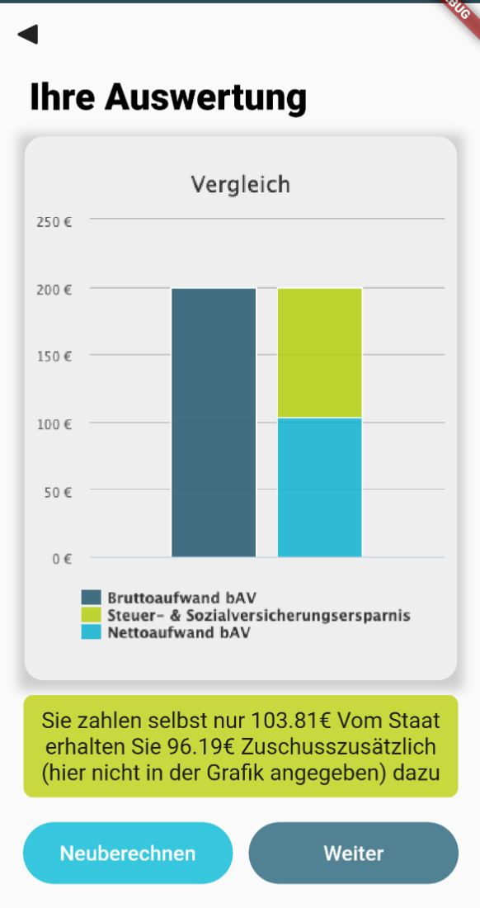

# bAV-Rechner

This was supposed to be an app for a company but things didn't work out so I didn't bother really finishing it. It's still nice to see on my GitHub because it looks as if it was ready to ship.
If you were to use it you have to change the path to the chromedriver in *bav_scraper.py*. 
The idea was that you type in your information and the app shows you how much tax-money you could save. 

#### This was how the app looked:

Landing Page               | Input                     | Evaluation Page 
:-------------------------:|:-------------------------:|:-------------------------:
||

#### How to run
* To actually start the program you have to run the *backend/api_logic.py* file to run the API-server for the communication between app and webscraper.
* The app is in german because the company was german. 
* This was coded on a Google Pixel Emulator so it might not fit every phone
